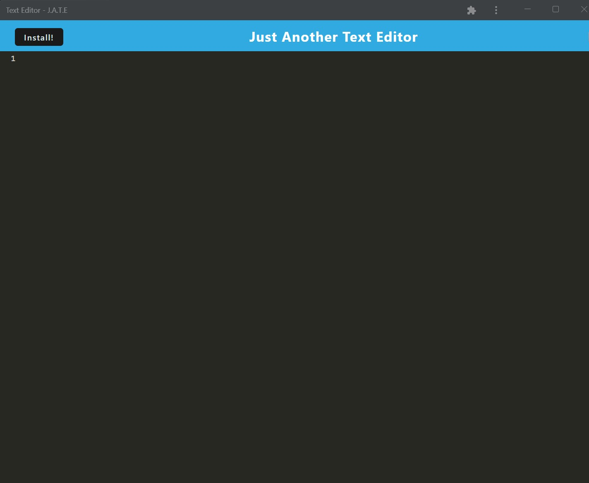

# Text-Editor
https://github.com/MattOz/React-Portfolio

## Description
A text editor progessive web app that uses data persistence techniques. The app functions both online and offline. It uses a package called idb to interact with the IndexedDB API which features a number of methods that are useful for storing and retrieving data.

[Live Link]([https://pure-basin-43127.herokuapp.com/]
)

## Table of Contents
- [Installation](#installation)
- [Usage](#usage)
- [Credits](#credits)
- [License](#license)
- [Contributing](#contributing)
- [Questions](#questions)

## Installation
Access the app through the heroku link. Download the app through the 'Install!' button.

## Usage
It works the same as any text editor.

## Credits
Class material was used as starter code for this project.

## License
This project is protected by the MIT license.

## Contributing
Contribute via GitHub.

## Questions?
https://github.com/MattOz/

If you have any questions, contact me on GitHub
